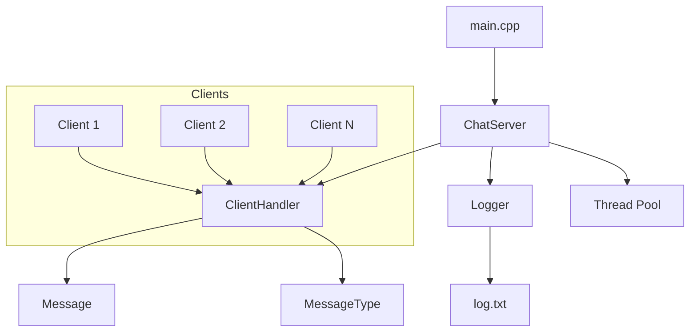
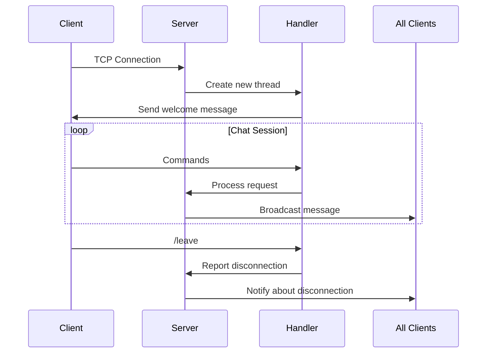

# 🚀 Chat Server - Documentation 💬

_Multithreaded chat server with full support for group communication, private messaging, and user management_

## 🌟 Introduction

The chat server is an advanced networking solution enabling real-time communication between multiple users. The application combines:

- **High Performance** ⚡ - Handles multiple concurrent connections
- **Security** 🔒 - Thread synchronization and data protection
- **Rich Features** 💬 - Comprehensive command set and capabilities
- **User-Friendly Interface** 🎨 - Colorful messages and intuitive prompts

## 🏗️ System Architecture

### 📊 Component Diagram



### 🔍 Key Components

1. **`ChatServer`** - The "Brain" of the system 🧠
   - Manages all connections
   - Coordinates communication between clients
   - Implements business logic

2. **`ClientHandler`** - "Client Assistant" 👤
   - Handles individual connections
   - Manages user sessions
   - Processes commands in real-time

3. **`Message`** - Message container 💌
   - Encapsulates content and metadata
   - Provides serialization/deserialization

4. **`Logger`** - Logging system 📖
   - Records timestamped events
   - Thread-synchronized file writing

## 📚 Detailed Class Descriptions

### 🖥️ `ChatServer` Class

_Central module managing the entire system_

```cpp
class ChatServer {
public:
    ChatServer(int port);  // Constructor initializing port
    void start();          // Start the server
    void stop();           // Safely stop the server
    void broadcast(const std::string& message, ClientHandler* exclude = nullptr);  // Broadcast messages
    void processMessage(ClientHandler* sender, const Message& msg);  // Process messages
private:
    void run();             // Main server loop
    std::set<std::shared_ptr<ClientHandler>> clients_;  // Active clients
    std::map<std::string, std::shared_ptr<ClientHandler>> nicknames_;  // Nickname mapping
    std::atomic<bool> running_;  // Server running flag
    Logger<std::string> logger_;  // Logging system
```

### 📱 `ClientHandler` Class
*Handles individual client connections*
```cpp
class ClientHandler {
public:
    ClientHandler(int socket, ChatServer* server, const std::string& defaultNickname);
    void start();  // Start handler thread
    void sendMessage(const std::string& msg);  // Send message to client
    void setNickname(const std::string& nickname);  // Change user nickname
private:
    void run();             // Main client handling loop
    void sendPrompt();      // Display prompt
    int client_socket_;     // Client network socket
    std::string nickname_;  // Current user nickname
    ChatServer* server_;    // Reference to main server
    std::unique_ptr<std::thread> thread_;  // Handler thread
    bool active_;           // Activity status
```

### ✉️ `Message` Class

_Message representation in the system_

```cpp
class Message {
public:
    Message(MessageType type, const std::string& sender,
            const std::string& content, const std::string& receiver = "");
    std::string serialize() const;  // Convert to network format
    static Message deserialize(const std::string& data);  // Create from network data
    MessageType getType() const;    // Get message type
    std::string getContent() const; // Get content
private:
    MessageType type_;      // Message type (Broadcast/Private/NickChange)
    std::string sender_;    // Message sender
    std::string content_;   // Message content
    std::string receiver_;  // Recipient (for private messages)
```

### 📝 `Logger` Class

_Event logging system_

```cpp
template <typename T>
class Logger {
public:
    Logger(const std::string& filename);  // Open log file
    void log(const T& message);  // Write message to log
private:
    std::ofstream logfile_;  // File stream
    std::mutex mtx_;         // Thread synchronization
```

## 🛠️ Technologies Used

### 💻 Development Environment


### 📚 Languages & Libraries


### 📦 Management & Compilation


## ⚙️ Operational Mechanisms

### 🔄 Connection Lifecycle



### 🔒 Security Mechanisms

- **RAII (Resource Acquisition Is Initialization)**
  Automatic resource management (sockets, files, mutexes) through destructors
- **Smart Pointers**
  Use of `unique_ptr` and `shared_ptr` for safe memory management
- **Thread Synchronization**
  System of mutexes (`std::mutex`) and locks (`std::lock_guard`) for safe access to shared resources
- **Atomic Flags**
  State flags (`std::atomic<bool>`) for safe inter-thread communication

## 🚀 Deployment

### ⚙️ System Requirements

- Linux system (Ubuntu 20.04+) 🐧
- C++17 compiler (GCC 9.0+)

### ⚡ Quick Start

```bash
# 1. Project compilation
mkdir build && cd build
cmake ..
make

# 2. Start the server
./ChatServer

# 3. Connect clients (in separate terminals)
telnet localhost 55555
```

## 🛜 Connecting to Online Server

The server is hosted on Oracle Cloud and publicly available at IP 130.162.247.29 on port 55555. When connecting:

### 🐧 For Linux Systems

Use the native Telnet client in terminal:

```bash
telnet 130.162.247.29 55555
```

### 🪟 For Windows Systems

Due to limitations of the standard Windows Telnet client, alternative solutions are recommended:

#### 🖥️ 1. PuTTY

1. Download and install [PuTTY](https://www.putty.org/) 📥
2. Configuration:
   - **Host Name**: `130.162.247.29`
   - **Port**: `55555`
   - **Connection type**: `Raw`
3. Click `Open` to connect

#### 🔌 2. Netcat

1. Download [Netcat for Windows](https://eternallybored.org/misc/netcat/)
2. Note: Many antivirus programs may flag it as suspicious, but it's safe
3. Run in command prompt:

```bash
nc.exe 130.162.247.29 55555
```

#### 🐧🔮 3. Windows Subsystem for Linux (WSL)

1. Install [WSL](https://learn.microsoft.com/pl-pl/windows/wsl/install)
2. Launch Ubuntu and install Telnet if needed:

```bash
sudo apt update && sudo apt install telnet
```

3. Connect:

```bash
telnet 130.162.247.29 55555
```

💡 The native Windows Telnet client may have limitations when interacting with chat applications. The alternatives above will provide full functionality. If you encounter issues, let us know! 🤝😊

## 📜 Summary

The chat server is a complete, ready-to-deploy solution that meets all functional and technical requirements. 💯

```plaintext
----------------------------------------
|   🚀 SYSTEM READY                   |
|   💻 Version: 1.0                   |
|   📆 Date: 2025-06-23               |
|   ⭐ Author: Bartosz Pieczek        |
----------------------------------------
```
