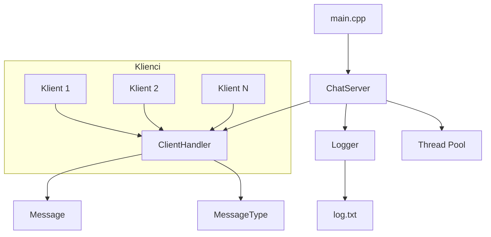
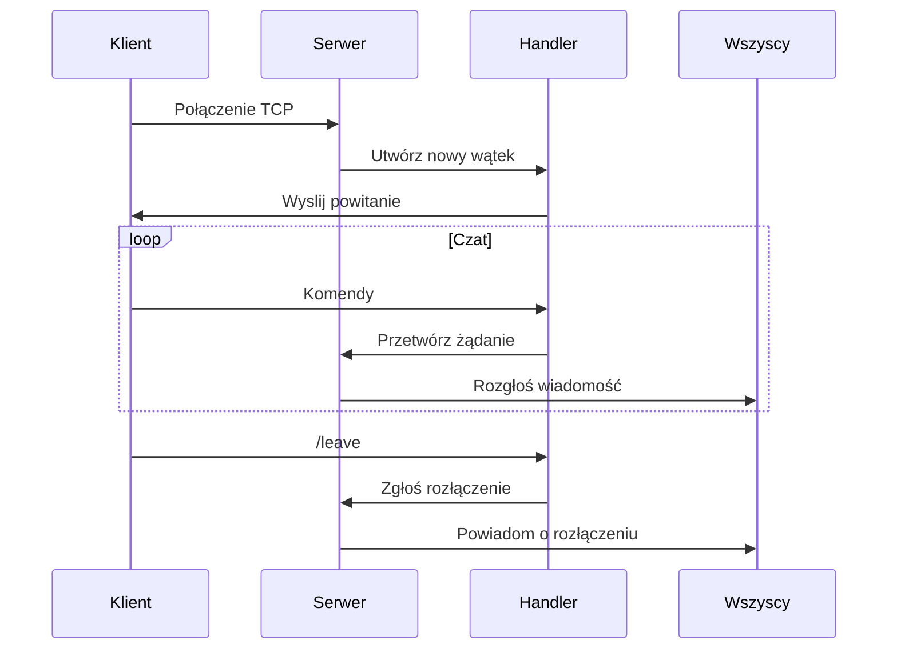

# 🚀 Czat Serwer - Dokumentacja 💬

_Wielowątkowy serwer czatu z pełną obsługą komunikacji grupowej, prywatnych wiadomości i zarządzania użytkownikami_

## 🌟 Wprowadzenie

Serwer czatu to zaawansowane rozwiązanie sieciowe umożliwiające komunikację wielu użytkowników w czasie rzeczywistym. Aplikacja łączy w sobie:

- **Wydajność** ⚡ - obsługa wielu jednoczesnych połączeń
- **Bezpieczeństwo** 🔒 - synchronizacja wątków i ochrona danych
- **Funkcjonalność** 💬 - bogaty zestaw komend i możliwości
- **Przyjazny interfejs** 🎨 - kolorowe komunikaty i intuicyjne prompty

## 🏗️ Architektura Systemu

### 📊 Diagram Komponentów



### 🔍 Kluczowe Komponenty

1. **`ChatServer`** - "Mózg" systemu 🧠

   - Zarządza wszystkimi połączeniami
   - Koordynuje komunikację między klientami
   - Implementuje logikę biznesową

2. **`ClientHandler`** - "Asystent klienta" 👤

   - Obsługuje pojedyncze połączenie
   - Zarządza sesją użytkownika
   - Przetwarza komendy w czasie rzeczywistym

3. **`Message`** - Kontener wiadomości 💌

   - Enkapsuluje treść i metadane
   - Zapewnia serializację/deserializację

4. **`Logger`** - System logowania 📖

   - Rejestruje zdarzenia z timestampem
   - Zapis do pliku z synchronizacją wątków

## 📚 Szczegółowy Opis Klas

### 🖥️ Klasa `ChatServer`

_Centralny moduł zarządzający całym systemem_

```cpp
class ChatServer {
public:
    ChatServer(int port);  // Konstruktor inicjalizujący port
    void start();          // Uruchomienie serwera
    void stop();           // Bezpieczne zatrzymanie serwera
    void broadcast(const std::string& message, ClientHandler* exclude = nullptr);  // Rozgłaszanie wiadomości
    void processMessage(ClientHandler* sender, const Message& msg);  // Przetwarzanie wiadomości
private:
    void run();             // Główna pętla serwera
    std::set<std::shared_ptr<ClientHandler>> clients_;  // Aktywni klienci
    std::map<std::string, std::shared_ptr<ClientHandler>> nicknames_;  // Mapowanie nicków
    std::atomic<bool> running_;  // Flaga działania serwera
    Logger<std::string> logger_;  // System logowania
```
### 📱 Klasa `ClientHandler`
*Obsługa indywidualnego połączenia klienta*
```cpp
class ClientHandler {
public:
    ClientHandler(int socket, ChatServer* server, const std::string& defaultNickname);
    void start();  // Uruchomienie wątku obsługi
    void sendMessage(const std::string& msg);  // Wysyłanie wiadomości do klienta
    void setNickname(const std::string& nickname);  // Zmiana nicku użytkownika
private:
    void run();             // Główna pętla obsługi klienta
    void sendPrompt();      // Wyświetlanie promptu
    int client_socket_;     // Gniazdo sieciowe klienta
    std::string nickname_;  // Aktualny nick użytkownika
    ChatServer* server_;    // Referencja do głównego serwera
    std::unique_ptr<std::thread> thread_;  // Wątek obsługi
    bool active_;           // Status aktywności
```

### ✉️ Klasa `Message`

_Reprezentacja wiadomości w systemie_

```cpp
class Message {
public:
    Message(MessageType type, const std::string& sender,
            const std::string& content, const std::string& receiver = "");
    std::string serialize() const;  // Konwersja do formatu przesyłanego
    static Message deserialize(const std::string& data);  // Tworzenie z danych sieciowych
    MessageType getType() const;    // Pobranie typu wiadomości
    std::string getContent() const; // Pobranie treści
private:
    MessageType type_;      // Typ wiadomości (Broadcast/Private/NickChange)
    std::string sender_;    // Nadawca wiadomości
    std::string content_;   // Treść wiadomości
    std::string receiver_;  // Odbiorca (dla wiadomości prywatnych)
```

### 📝 Klasa `Logger`

_System rejestracji zdarzeń_

```cpp
template <typename T>
class Logger {
public:
    Logger(const std::string& filename);  // Otwarcie pliku logów
    void log(const T& message);  // Zapis wiadomości do logu
private:
    std::ofstream logfile_;  // Strumień plikowy
    std::mutex mtx_;         // Synchronizacja wielowątkowa
```

## 🛠️ Użyte Technologie

### 💻 Środowisko Programistyczne


### 📚 Języki i Biblioteki


### 📦 Zarządzanie i kompilacja


## ⚙️ Mechanizmy Działania

### 🔄 Cykl Życia Połączenia



### 🔒 Mechanizmy Bezpieczeństwa

- **RAII (Resource Acquisition Is Initialization)**
  Automatyczne zarządzanie zasobami (gniazda, pliki, mutexy) poprzez destruktory
- **Smart Pointers**
  Wykorzystanie `unique_ptr` i `shared_ptr` dla bezpiecznego zarządzania pamięcią
- **Synchronizacja Wątków**
  System mutexów (`std::mutex`) i locków (`std::lock_guard`) dla bezpiecznego dostępu do współdzielonych zasobów
- **Atomic Flags**
  Flagi stanu (`std::atomic<bool>`) dla bezpiecznej komunikacji między wątkami

## 🚀 Wdrażanie

### ⚙️ Wymagania Systemowe

- System Linux (Ubuntu 20.04+) 🐧
- Kompilator C++17 (GCC 9.0+)

### ⚡ Szybki Start

```bash
# 1. Kompilacja projektu
mkdir build && cd build
cmake ..
make

# 2. Uruchomienie serwera
./ChatServer

# 3. Podłączanie klientów (w osobnych terminalach)
telnet localhost 55555
```

## 🛜 Łączenie z serwerem online

Serwer postawiony jest na Oracle Cloud i dostępny publicznie pod adresem 130.162.247.29 i portem 55555. Przy łaczeniu z nim zaleca się:

### 🐧 Dla systemu Linux

Użyj natywnego klienta Telnet w terminalu:

```bash
telnet 130.162.247.29 55555
```

### 🪟 Dla systemu Windows

Ze względu na ograniczenia standardowego klienta Telnet w Windowsie, zalecane są alternatywne rozwiązania:

#### 🖥️ 1. PuTTY

1. Pobierz i zainstaluj [PuTTY](https://www.putty.org/) 📥
2. Konfiguracja:
   - **Host Name**: `130.162.247.29`
   - **Port**: `55555`
   - **Connection type**: `Raw`
3. Kliknij `Open` aby połączyć

#### 🔌 2. Netcat

1. Pobierz [Netcat dla Windows](https://eternallybored.org/misc/netcat/)
2. Uwaga wiele antywirusów wykrywa program jako szkodliwy jednak jest on bezpieczny.
3. Uruchom w wierszu poleceń:

```bash
nc.exe 130.162.247.29 55555
```

#### 🐧🔮 3. Windows Subsystem for Linux (WSL)

1. Zainstaluj [WSL](https://learn.microsoft.com/pl-pl/windows/wsl/install)
2. Uruchom Ubuntu i zainstaluj Telnet jeśli go nie ma:

```bash
sudo apt update && sudo apt install telnet
```

3. Połącz się:

```bash
telnet 130.162.247.29 55555
```

💡 Klient Telnet w Windows może mieć ograniczenia w interakcji z aplikacjami czatu. Powyższe alternatywy zapewnią pełną funkcjonalność. Jeśli masz problemy, napisz! 🤝😊

## 📜 Podsumowanie

Serwer czatu to kompletne, gotowe do wdrożenia rozwiązanie, które spełnia wszystkie wymagania funkcjonalne i techniczne. 💯

```plaintext
----------------------------------------
|   🚀 SYSTEM GOTOWY                  |
|   💻 Wersja: 1.0                    |
|   📆 Data: 2025-06-23               |
|   ⭐ Autor: Bartosz Pieczek         |
----------------------------------------
```
